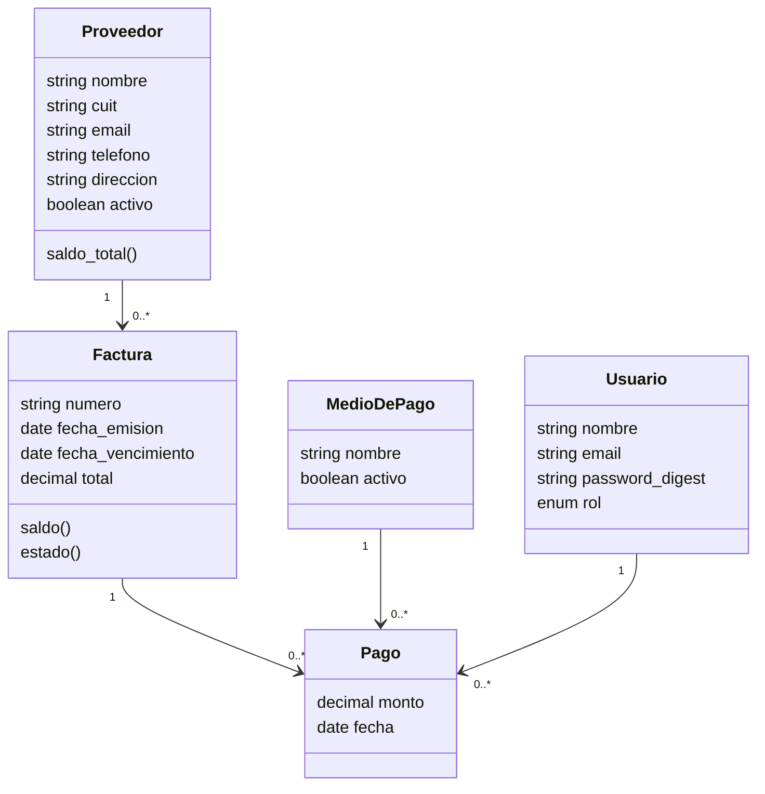

# Comercio Deudas

Registro de deudas y pagos a proveedores de un pet shop.

TP N.º 1 de Programación IV (UTN FRLP) — proyecto individual.

## Objetivo

Un comercio compra mercadería a varios proveedores y va acumulando facturas que paga
total o parcialmente a lo largo del tiempo. Llevar esa información en papel o en una
planilla hace difícil responder dos preguntas cotidianas: cuánto se le debe hoy a cada
proveedor y qué facturas están por vencer.

La aplicación resuelve eso: registra los proveedores, las facturas que emiten y los pagos
que se les hacen, calculando el saldo pendiente de cada factura y avisando cuando un
vencimiento se aproxima.

## Tipos de usuario

| Tipo | Cómo entra | Qué puede hacer |
| --- | --- | --- |
| **Administrador** (`rol: admin`) | Back-office web en `/admin`, con usuario y contraseña | Administrar proveedores, facturas, pagos y medios de pago |
| **Operador** (`rol: operador`) | API JSON, con token obtenido al hacer login | Consultar facturas y saldos, y registrar pagos desde el front-end público (TP N.º 2) |

Ambos contextos usan el mismo modelo `Usuario`: lo que cambia es el rol y el mecanismo de
autenticación (sesión en el back-office, token en la API).

## Modelo de datos

Cinco entidades principales:

- **Proveedor** — a quién se le debe. Identificado por CUIT (único).
- **Factura** — un comprobante emitido por un proveedor, con fecha de emisión, fecha de
  vencimiento y total. Su número es único por proveedor.
- **Pago** — una imputación de dinero contra una factura, con su medio de pago y el
  usuario que la registró.
- **MedioDePago** — efectivo, transferencia, cheque, etc.
- **Usuario** — quien opera el sistema, con rol `admin` u `operador`.



### Reglas de negocio

Están implementadas en los modelos, no en las vistas:

- El **saldo** de una factura se calcula como `total - suma de sus pagos`; no se guarda en
  la base.
- El **estado** de una factura (`pendiente`, `parcial`, `pagada`, `vencida`) se deriva del
  saldo y de la fecha de vencimiento.
- Un pago **no puede superar el saldo pendiente** de su factura, ni tener fecha anterior a
  la emisión de la misma.
- La fecha de vencimiento de una factura no puede ser anterior a su emisión.
- No se puede eliminar un proveedor con facturas, ni un medio de pago o un usuario con
  pagos asociados.

## Puesta en marcha

Requisitos: Ruby 3.3.10 (la versión está fijada en `.ruby-version`) y SQLite 3.8+.

```bash
git clone <URL-del-repositorio>
cd comercio_deudas
bundle install
bin/rails db:prepare    # crea la base, migra y carga los datos de ejemplo
bin/rails server        # http://localhost:3000
```

La raíz redirige al back-office: <http://localhost:3000/admin>

### Acceso al back-office

`db/seeds.rb` crea dos usuarios, uno por cada contexto de uso:

| Rol | Email | Contraseña | Acceso |
| --- | --- | --- | --- |
| Administrador | `admin@petshop.test` | `admin12345` | Back-office en `/admin` |
| Operador | `operador@petshop.test` | `operador12345` | Solo API (no entra al back-office) |

También carga cuatro medios de pago, tres proveedores y cuatro facturas de ejemplo, una
por cada estado posible (pendiente, parcial, pagada y vencida).

### API

API JSON versionada en `/api/v1`, pensada para el front-end público (TP N.º 2). Cualquier
usuario puede usarla: se obtiene un token con email y contraseña y se lo envía en cada
request con el encabezado `Authorization: Bearer <token>`. Cada login emite un token nuevo
e invalida el anterior; el logout también lo invalida.

| Método | Ruta | Descripción |
| --- | --- | --- |
| `POST` | `/api/v1/session` | Login con `email` y `password`; devuelve el token y el usuario |
| `DELETE` | `/api/v1/session` | Logout: invalida el token |
| `GET` | `/api/v1/facturas` | Facturas con total pagado, saldo y estado, por fecha de vencimiento |
| `GET` | `/api/v1/facturas/:id` | Una factura con sus pagos |
| `POST` | `/api/v1/facturas/:factura_id/pagos` | Registra un pago (`pago[monto]`, `pago[fecha]`, `pago[medio_de_pago_id]`) |
| `GET` | `/api/v1/proveedores` | Proveedores con su saldo total |
| `GET` | `/api/v1/proveedores/:id` | Un proveedor con sus facturas |
| `GET` | `/api/v1/medios_de_pago` | Medios de pago activos |

```bash
curl -X POST http://localhost:3000/api/v1/session \
  -d email=operador@petshop.test -d password=operador12345
# {"token":"…","usuario":{…}}

curl http://localhost:3000/api/v1/facturas -H "Authorization: Bearer <token>"
```

Los importes (`total`, `saldo`, `monto`, etc.) se devuelven como string para no perder
precisión decimal. Los errores responden con el código HTTP correspondiente: `401` sin token
válido, `404` si el recurso no existe y `422` con `{"errores": {campo: [mensajes]}}` cuando
un pago no pasa las validaciones (por ejemplo, si supera el saldo de la factura).

### Base de datos

La aplicación usa SQLite, con los archivos en `storage/` (no se versionan). Para
recrearla desde cero, incluyendo los datos de ejemplo:

```bash
bin/rails db:reset
```

### Tests y análisis estático

```bash
bin/rails test     # Minitest
bin/rubocop        # estilo (rubocop-rails-omakase)
bin/brakeman       # análisis de seguridad
```

## Estado del proyecto

Implementado:

- Migraciones, modelos, relaciones y validaciones de las cinco entidades, con las reglas
  de negocio de saldo, estado y tope de pago.
- Back-office en `/admin` con autenticación por sesión, autorización por rol y CRUD de
  proveedores, facturas, pagos, medios de pago y usuarios.
- API JSON versionada en `/api/v1` con login por token.

Pendiente:

- Active Storage: comprobante adjunto a la factura.
- Action Mailer: aviso de factura próxima a vencer.
- Tests automatizados de modelos, validaciones y cálculo de saldo.
